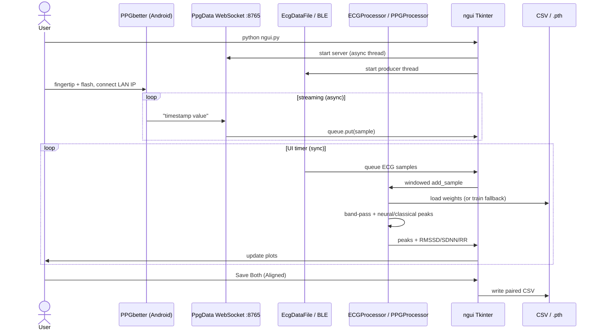

import cover from "./cover.svg";
import coverFeatured from "./cover-featured.svg";
import poster from "./poster.svg";

export const meta = {
  slug: "hrv-mobile-ml",
  title: "Analysis of Heart Rate Variability Using Mobile Devices and Machine Learning",
  date: "2026",
  category: "Research / Applied ML (biosignals)",
  role: "Co-author & primary codebase contributor (team of five)",
  summary:
    "Research pipeline and desktop GUI for mobile ECG/PPG peak detection and HRV/PTT analysis on six subjects, pairing a Polar H10 with a camera-flash Android PPG app (software green filter) and comparing CNN detectors to Pan–Tompkins/NeuroKit baselines. Extracurricular 2025 project; TASK Quarterly publication released March 2026.",
  cover,
  coverFeatured,
  poster,
  // Drop an 8s vertical clip next to this file, import it, and set `reel`.
  // reel,
  reelCaption:
    "Six subjects, Polar ECG + fingertip PPG — CNNs and Pan–Tompkins on the same beats, then RMSSD/SDNN side by side. ECG peak F1 ≈ 0.98; PPG stays honest about motion.",
  tags: [
    "HRV",
    "PPG",
    "ECG",
    "PyTorch",
    "signal-processing",
    "mobile-sensing",
    "research",
    "Pan-Tompkins",
  ],
  featured: true,
  links: [
    {
      label: "Paper",
      href: "https://journal.mostwiedzy.pl/TASKQuarterly/article/view/3699",
    },
    {
      label: "GitHub",
      href: "[[ PASTE_RESEARCH_REPO_URL ]]",
    },
  ],
};

export const glossary = [
  {
    term: "PPG",
    definition:
      "Photoplethysmography — estimating blood-volume pulses optically, here from a phone camera aimed at a fingertip lit by the flash, with a software green mute/filter applied in the acquisition app.",
  },
  {
    term: "ECG",
    definition:
      "Electrocardiography — recording the heart’s electrical activity; in this project primarily via a Polar H10 chest strap.",
  },
  {
    term: "HRV",
    definition:
      "Heart rate variability — statistics of variation between successive beat intervals (e.g. SDNN, RMSSD), used as a physiology/research marker.",
  },
  {
    term: "RR interval",
    definition:
      "Time between consecutive ECG R-peaks; the classical beat-to-beat interval for HRV from ECG.",
  },
  {
    term: "IBI",
    definition:
      "Inter-beat interval — time between successive PPG pulse peaks; PPG analogue of the RR interval.",
  },
  {
    term: "RMSSD",
    definition:
      "Root mean square of successive differences of NN intervals; a short-term HRV measure computed in the GUI and analysis scripts.",
  },
  {
    term: "SDNN",
    definition:
      "Standard deviation of NN intervals over a window; an overall HRV dispersion measure shown alongside RMSSD.",
  },
  {
    term: "PTT",
    definition:
      "Pulse transit time — delay between an ECG R-peak and the corresponding PPG pulse peak after time alignment.",
  },
  {
    term: "Pan–Tompkins",
    definition:
      "A classical ECG QRS/R-peak detector (band-pass, derivative, square, integrate, threshold) implemented in pan_tompkins.py and used as baseline/labels.",
  },
  {
    term: "SE block",
    definition:
      "Squeeze-and-Excitation — a channel-attention module that reweights convolutional feature maps; used inside PPGPeakDetector.",
  },
  {
    term: "WebSocket",
    definition:
      "A persistent TCP-based messaging channel; PPGbetter streams luma samples to the desktop listener on port 8765.",
  },
  {
    term: "F1",
    definition:
      "Harmonic mean of precision and recall for peak matching within a time tolerance; primary detector quality metric in comparison scripts.",
  },
];

## F1 is not the whole story

On one PPG evaluation dump checked into `ppg.md`, a residual CNN reports **Accuracy 98.17%** and **F1 0.9774** on a sample-level confusion matrix — then drops to **F1 0.895** when the same family of detections is scored against reference peaks with a **~264 ms** matching tolerance (TP 64 / FP 7 / FN 8). That gap is the project in miniature: beat detection for <Term>HRV</Term> is not a classification leaderboard problem; it is a timing-and-physiology problem under messy mobile sensors. If you only ship the first number, recruiters and reviewers will over-trust the system the first time a finger slips.

This repository is the Python half of a Gdańsk University of Technology extracurricular project (2025) on mobile <Term>ECG</Term> and <Term>PPG</Term> for heart-rate variability, published March 2026 as *Analysis of heart rate variability using mobile devices and machine learning* (TASK Quarterly). Recordings came from **six** subjects: Polar H10 chest/waist ECG plus fingertip camera PPG. The companion Android app ([PPGbetter](https://github.com/JanBancerewicz/PPGbetter)) lights the finger with the flash, applies a **software green mute/filter** on the frames, and streams averaged luma over a <Term>WebSocket</Term>.

Primary git committer: Jan Bancerewicz (~57 commits). Co-authors: Julian Kotłowski, Mateusz Rzęsa, Julia Morawska, Ostap Lozovyy.

### Why the naive approach fails

Phone “heart rate” APIs and raw brightness thresholds give smoothed BPM, not beat-to-beat intervals. Camera PPG is inverted, motion-corrupted, and clocked differently from Polar ECG (~130 Hz). Without modality-specific band-pass filters, refractory spacing, and a classical/NeuroKit reference, you cannot tell whether an <Term>RMSSD</Term> mismatch is physiology or a missed peak.

### How it works

Entry point: `appgui/ngui.py`. Producer threads feed queues — PPG via `PpgData` on **`0.0.0.0:8765`**, ECG via `EcgDataFile` or `EcgDataBluetooth`. `ECGProcessor` / `PPGProcessor` window, filter, detect peaks, and drive live plots plus RMSSD / <Term>SDNN</Term> / RR.

1. **Filter** — ECG Butterworth **0.5–45 Hz**; PPG **0.5–5 Hz** (aligned validation also inverts PPG).
2. **Classical peaks** — <Term>Pan–Tompkins</Term> (ECG); `find_peaks` / local maxima with refractory spacing (PPG).
3. **Neural peaks** — `ECG_CNN` (Conv1D → LSTM, **256**-sample windows); `PPGPeakDetector` (residual Conv1D + <Term>SE block</Term>, **50–100**-sample segments).
4. **Postprocess** — threshold, enforce min inter-peak distance, stamp unix times for pairing.
5. **HRV / PTT** — RR vs <Term>IBI</Term> → mean / SDNN / RMSSD; <Term>PTT</Term> = t_PPG − t_ECG after absolute-time alignment.

Offline scripts `comparison/ecg_ai_vs_pan_tompkins.py` and `ppg_ai_vs_real.py` print precision/recall/F1; `comparePPGECG.py` plots aligned dual traces.

### Before → after

**Start:** Polar connect + early ECG CNN R-peak plots — detect chest-strap beats, little else.

**Then (git arc):** live Tkinter → HRV GUI → PPG CNN → timestamp/alignment fixes (`fix-hrv-final`, `peaks-compare`) → Pan–Tompkins baselines → residual+SE PPG net → cleanup for publication.

**End:** Replay or stream fingertip PPG alongside Polar/file ECG, inspect peaks and side-by-side HRV, export aligned CSV, and reproduce detector comparisons — enough to show that under controlled recording, mobile PPG can approximate ECG HRV while staying more artifact-sensitive.

### Decisions I would defend

1. **Classical + neural side by side** — ECG labels partly come from Pan–Tompkins; keeping `pan_tompkins.py` and comparison scripts makes that circularity visible.
2. **Separate architectures per sensor** — 256-sample CNN+LSTM for ECG vs short residual windows for optical PPG beats one shared “universal” model.
3. **Thin phone, heavy desktop** — PPGbetter only acquires; Tkinter + CUDA/CPU PyTorch handles ML and paper figures. The WebSocket `timestamp value` protocol on :8765 stays trivial to implement on Android at the cost of no auth and a bind to `0.0.0.0`.

### Where it breaks

Motion and poor finger contact wreck PPG (README). Window edges miss or duplicate beats; missing `.pth` weights trigger slow `get_or_train_model` (the GUI even cuts training epochs to avoid a multi-minute freeze on startup). The practical demo path is **file replay** (`EcgDataFile` + saved PPG) — live phone streaming still works in code, but the acquisition device is gone. There is no CI; sample-level 98% accuracy overstates beat-match quality when tolerance is ~250 ms.

### Outcome

On six subjects under controlled recording, README reports ECG peak <Term>F1</Term> ≈ **0.98** (accuracy ≈ **97%**). For PPG, the F1 range is **0.824–0.977**: **0.824** for peak matching with an 8-sample / **264 ms** tolerance (research-project comparison script), up to **0.977** for sample-level confusion-matrix classification. `ppg.md`’s peak-match F1 **0.895** at that same ~264 ms tolerance is the number to put next to any sample-accuracy claim. Exact F1 @ 50/100/150 ms, median PTT, and plot-latency numbers were not stated in the paper. PPG can approximate ECG-based HRV when recordings are clean, with higher sensitivity to motion. Stick to detector metrics already in-repo — do not quote paper RMSSD/SDNN error tables.

## Project snapshot

| Field | Value |
| --- | --- |
| One-liner | Python research codebase for filtering, classical + neural peak detection, and HRV/PTT comparison on Polar H10 ECG and camera-based PPG from a companion Android app |
| Problem | Can mobile-grade ECG/PPG acquisition support beat-to-beat HRV analysis comparable to classical ECG pipelines under controlled conditions? |
| End user | Researchers / student engineers validating mobile HRV methods; demo operators of the Tkinter GUI (`ngui.py`). Not a clinical end-user product |
| Team | Jan Bancerewicz (primary committer), Julian Kotłowski, Mateusz Rzęsa, Julia Morawska, Ostap Lozovyy |
| Cohort | **6** subjects (Polar H10 ECG + fingertip camera PPG) |
| Stack | Python 3; PyTorch (~2.6 CUDA); SciPy/NumPy/Pandas; NeuroKit2; scikit-learn; Matplotlib; Tkinter; `websockets`; `bleak`; [PPGbetter](https://github.com/JanBancerewicz/PPGbetter) |
| Architecture | Single-repo research pipeline + desktop GUI. Live ingest (BLE ECG / WebSocket PPG) → processors → peaks → RR/IBI → HRV (+ optional PTT) |
| Status | Research project (2025); peer-reviewed publication **March 2026** (TASK Quarterly). Not production clinical software |
| Paper | [TASK Quarterly](https://journal.mostwiedzy.pl/TASKQuarterly/article/view/3699) |

**In scope:** offline training/eval of peak detectors; live desktop visualization; classical baselines (Pan–Tompkins, `find_peaks`); HRV from RR/IBI; PTT on aligned ECG–PPG; example/partial datasets.

**Out of scope:** clinical certification; production on-device mobile ML; full cohort packaging; CI/CD deploy; hospital EHR integration.

**Constraints:** CUDA preferred; real-time-ish GUI with windowed inference; biometric privacy — full datasets limited in-repo. Demo/screenshot path: **file replay** (Android device no longer available).

## Results

| Metric | Value | Conditions | Conclusion | Conf. |
| --- | --- | --- | --- | --- |
| ECG R-peak F1 | ≈ 0.98 | README / Polar H10; neural detector vs NeuroKit / Pan–Tompkins | CNN+LSTM viable for this strap/FS; classical baseline still required | reported |
| ECG accuracy | ≈ 97% | README model section | Sample-level accuracy tracks F1 but is easier to inflate | reported |
| PPG F1 (range) | **0.824–0.977** | Peak match @ 8 samples / 264 ms (research-project script) → sample-level confusion matrix | Protocol dominates headline score | reported |
| PPG sample accuracy / F1 | 98.17% / 0.9774 | `ppg.md` confusion matrix `[[9609,9],[7,375]]` | Strong frame-level separation after training | reported |
| PPG AI vs reference peaks | Prec 0.901, Rec 0.889, F1 **0.895** | `ppg.md`; tolerance ≈ 264 ms (8 samples) | Beat-matching is the metric that matters for HRV | reported |
| PPG band-pass | 0.5–5 Hz, order 4 | README + processors (ECG 0.5–45 Hz) | Wrong filter destroys optical peaks | measured |
| ECG window / FS | 256 samples; FS=130 | `ECG_CNN`, comparison script | Window ≈ 2 s at 130 Hz | measured |
| Cohort size | 6 subjects | Author-confirmed | Small controlled cohort — keep generalization claims narrow | reported |
| Paper RMSSD/SDNN tables | — | — | **Do not quote** in this write-up (author) | n/a |
| F1 @ 50/100/150 ms | not in paper | — | Not stated in the article | n/a |
| Median PTT / plot latency | not in paper | Alignment pipeline exists | Not stated in the article | n/a |

**Takeaway:** publish matching tolerance and label source next to F1. Sample-level 98% is not the same claim as beat-match F1 0.895.

## Lessons

1. **Evolution:** Polar/ECG CNN → live GUI → PPG path → timestamp alignment as a first-class subsystem → classical baselines → residual+SE PPG model → cleanup for publication.
2. **Trade-offs:** dual detector paths; `get_or_train_model` convenience vs long GUI startup; file replay default vs BLE live; open WebSocket vs zero auth; labels from classical detectors (fast, somewhat circular).
3. **Worked:** side-by-side comparison scripts; explicit band-pass per modality; held-out file lists; GUI tabs that mirror paper figures.
4. **Friction:** path churn; inconsistent windows (50 vs 100) and tolerances; no automated tests; no single “canonical run” Makefile.
5. **Next time:** one `configs/eval.yaml`; frozen metrics JSON from re-runnable scripts; auth-bind WebSocket; pytest smoke on synthetic fixtures; document file-replay as the supported demo path.
6. **Transferable:** for physiological ML, publish the **matching tolerance and label source** next to F1 — otherwise mobile-sensor results are not comparable.

## Serving path

**Canonical (article / screenshots):** file replay of ECG + PPG CSVs → peaks → HRV (PTT optional). Live PPGbetter WebSocket + BLE ECG remains implemented but is not the preferred demo path.

```text
User                PPGbetter           PpgData:8765      EcgSource         Processors              GUI
 |  start ngui            |                  |                |                      |                      |
 |----------------------->|                  |                |                      |                      |
 |  start WS server       |                  | listen 0.0.0.0 |                      |                      |
 |  place finger+flash    |--async WS msg--->| put(queue)     |                      |                      |
 |                        |                  |                |--samples----------->| filter+detect        |
 |                        |                  |                |                      |--peaks/HRV---------->| update
 |  optional Save Both    |                  |                |                      | align timestamps     | CSV
```



**Error variants:** WS disconnect freezes PPG while ECG may continue; missing `.pth` triggers slow retrain or `find_peaks` fallback. Science bottleneck is **cross-device time alignment**, not model FLOPs.

## Screenshot plan

> Prefer **file replay** / offline scripts — Android device no longer available. Soft-anonymize subject nicknames in filenames if shown.

1. **PPG+ECG tab with dual peaks (replay)** — `ngui.py` tab “PPG + ECG” with red peak markers on both traces. Anchors acquisition + detection. Must. Fallback: README asset / Matplotlib from comparison scripts.
2. **HRV dashboard (ECG vs PPG)** — HRV tab with RMSSD, SDNN, RR for EKG vs PPG; ≥60 s aligned replay or “Save HRV Plots (PNG, 300dpi)”. Must. Fallback: exported PNG from a prior session.
3. **AI vs Pan–Tompkins ECG peaks** — `ecg_ai_vs_pan_tompkins.py` plot + terminal F1 block (`data/ecg/ECG2.csv`, `cnn/ecgcnn.pth`). Must. Fallback: README comparison figure.
4. **PPG AI vs reference peaks (tolerance callout)** — `ppg_ai_vs_real.py` overlay + Precision/Recall/F1 and tolerance in ms (`comparison/ppg_data_aligned.csv`, `ppg_peak_model.pth`). Must. Fallback: numbers from `ppg.md`.
5. **Phone acquisition (archive only)** — existing PPGbetter capture: flash + software green mute/filter + waveform. Nice. Fallback: caption + link to PPGbetter README.
6. **Aligned ECG–PPG / Peaks Compare** — Peaks Compare tab or `comparePPGECG.py` dual plot from aligned CSVs. Nice. Fallback: mermaid sequence only.
7. **Architecture / filter passbands** — diagram: Polar + Phone → queues → processors → HRV; 0.5–45 Hz vs 0.5–5 Hz. Nice. Fallback: ASCII/mermaid above.
8. **Training split hygiene** — `TEST_FILES` / `VAL_FILES` held-outs in `cnn/ecg/train.py` and `cnn/ppg/data.py`. Nice. Fallback: bullet list in body.
